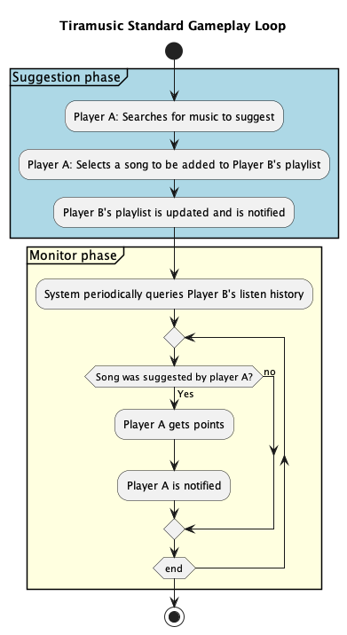

# Tiramusic

**Finding new music that you like is the best feeling according some people. Tiramisu is the best according to the same people. We combine that.**

## Overview
Music discovery gamified. Users can suggest songs to each other and earn points based on how well their recommendations are received. If the recipient plays and enjoys the song (measured through playback metrics or engagement), the recommender earns points. The more obscure the artist, the more points earned. The app integrates with the Spotify API to manage playlists and track listening activity seamlessly.

## 🔍Problem and opportunity
During downtime people can work on a fun project and learn technologies, accomplish targets while following the Finaps Standards

## 🎯Goals / Non-goals
Goals
- Playable MVP with the core mechanics
- Work with Spring, API first approach (Try new tools, libraries, frameworks, quarkus?)

Out of scope
- some stuff
- Mobile version?

## 🕹️Proposed Gameplay + Potential Features

Two players sign-up for the application, which creates a playlist on their behalf.

1. Player A searches for a track to add to players B's list.
2. Player B is made aware of a new track being suggested by player A
3. Tiramusic then periodically checks Player B's recently played songs. If any of those songs played match those suggested by Player A, Player A is rewarded points.

**Scoring is adjust by the following factors:**

- Popularity of the band.
- Play count of the chosen track.
- Frequency of repeated plays.

**Possible points/achievements ideas:**

- Engagement related, streaks of suggesting music (x number of days).
- Mastering particular genres.
- Discovery of the most obscure artists/songs of the week.

### Future ideas
1. **Explore mode**: A mode where users can browse through various curated playlists or radio stations with hints and clues about the featured tracks. Based on https://www.music-map.com/ and https://www.gnoosic.com/
2. **Bounty**: Users propose a theme/mood/scenario - users propose songs to match. Winner determined by vote/engagement by others.
3. **Anonymous Recommendation**: Users's could suggest music to others based on limited information regarding their listening habits. Player A really enjoys high tempo sad music - Player B must work within these confines & has no personal connection.

## 🧱 Technical details
- API First (explore and test more Apidog?)
- Java
- Spring?
- Integrate with spotify web api
- Explore Spotify auth sso, if not identity-service?

## ✅ Success evaluation
- A deployed version the team can play
- One or two people say "I learned something new" or "this is actually fun"

## Open for discussion:
1. **Target audience**: Spotify Premium Finapsers who are done with the suggestions algorithm.
2. **Competitor analysis**: Reddit? Instagram accounts? Vague and not personalized.
3. **Deployment**: azure web app? aks? other than azure provider? 
4. **Team**: ...

